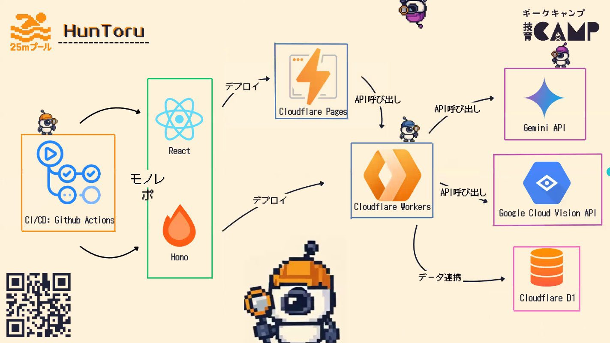

  
  <h1>HunToru</h1>
  
お題をHuntしよう🔎

  <a href="https://x.com/geek_pjt/status/1949403645235310686" target="_blank">受賞ポスト</a> 
  <a href="https://huntoru-web.pages.dev/" target="_blank">デプロイURL</a>
  <a href="https://www.canva.com/design/DAGuRl--lyI/ZIRYSmaDDQniac4WzTEIwg/view?utm_content=DAGuRl--lyI&utm_campaign=designshare&utm_medium=link2&utm_source=uniquelinks&utlId=hd80fef6036" target="_blank">プレゼン資料</a>

 

  
  
  
  
  
  
  
  
  
  
  

  <h2>Architecture</h2>
  

